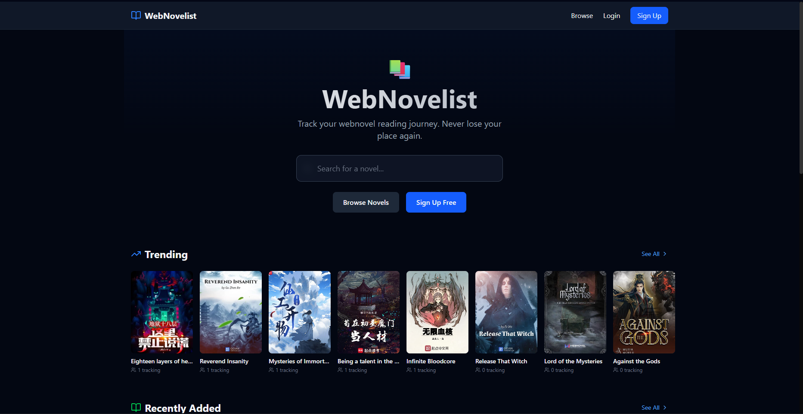
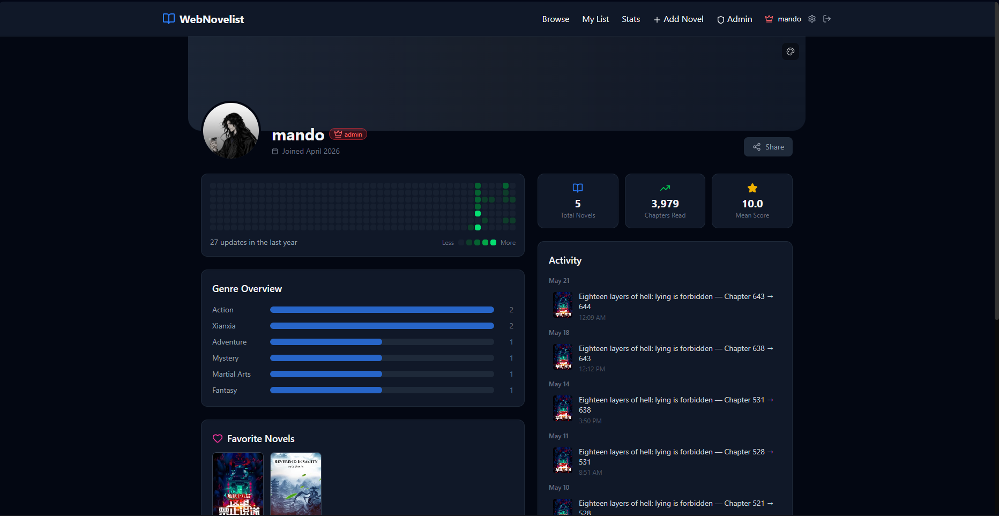

# WebNovelist

> An AniList-style tracker for web novels — log what you're reading, rate and review, build a library, and share a public profile.

**Live:** [novel.anthonyta.dev](https://novel.anthonyta.dev)

---

<!--
## Screenshots

| Home | Novel | Profile |
|------|-------|---------|
|  |  |  |
-->

## Features

- **Reading list** — track novels across five statuses (Reading, Completed, On Hold, Dropped, Plan to Read), with per-entry rating, current chapter, reread count, notes, and a reading link.
- **Stats dashboard** — aggregate metrics across your library: totals by status, chapters read, average rating, and genre breakdown.
- **Activity heatmap** — a GitHub-style contribution graph of your reading activity over the past year.
- **Public profiles** — shareable `/user/<username>` pages featuring up to 5 favourite novels, authors, and characters each, with a blurred cover art banner.
- **Author pages** — dedicated `/author/[id]` pages with bio, linked novels grid, and a favourite button. Authors are managed by admins with Cloudinary image support; novel edit pages link novels to their author page.
- **Character pages** — dedicated `/character/[id]` pages with role badge and linked novel. Characters are managed inline on the novel edit page; users can favourite up to 5 per profile.
- **Browse & search** — find novels by title, author, or genre with live filtering.
- **Admin panel** — role-based management of novels, authors, and users. `/admin/novels` lists the full catalog with search, status badges, cover thumbnails, and edit/delete actions. `/admin/authors` supports create, edit, delete, and image upload.
- **Authentication** — email/password sign-in via Clerk with secure sessions and webhook-based user sync.
- **Image uploads** — avatars, novel covers, and author images via Cloudinary; customizable profile banners.

## Tech Stack

| Area | Choice |
|------|--------|
| Framework | Next.js 16 (App Router, React 19, Server Components) |
| Language | TypeScript |
| Auth | Clerk |
| Database / ORM | PostgreSQL + Prisma |
| Styling | Tailwind CSS v4 |
| Validation | Zod |
| Media | Cloudinary |
| Email | Resend |
| Rate limiting | rate-limiter-flexible |
| Testing | Vitest |
| CI | GitHub Actions |
| Hosting | Vercel |

## Architecture Highlights

- **Clerk identity synced to relational data.** Clerk owns authentication and sessions; a local `User` table owns app-specific data (username, role, favorites, reading list), linked by `clerkId` and kept in sync via Clerk webhooks. Just-in-time provisioning creates a database row on first sign-in even before the webhook fires.
- **Authorization enforced on the server.** A single `getCurrentUser()` helper resolves the database user per request, and every API route verifies roles server-side — the UI never gates security on its own.
- **Edge protection & security headers.** Route protection and hardening headers (`X-Frame-Options`, `Strict-Transport-Security`, etc.) run in a single Next.js middleware (`proxy.ts`).
- **Startup env validation.** A Zod schema in `lib/env.ts` validates all required environment variables at server startup via Next.js `instrumentation.ts`, failing fast with a clear error message if anything is missing.
- **Performance.** The home page is fully server-rendered — no client spinner or layout shift. The browse page genre list is cached with `unstable_cache` (1h TTL) to avoid a full table scan on every request. Cloudinary images are cached 24h via `minimumCacheTTL`; above-the-fold images use the `priority` prop for faster LCP.

## Roles

| Role | Permissions |
|------|-------------|
| **Admin** | Full access — manage novels and users, no rate limits |
| **Moderator** | Add/edit novels, delete moderators and users |
| **User** | Browse, manage their own list, view stats |

## Quality

- **Tests** — Vitest unit/integration tests covering lib utilities and all major API routes (`__tests__/`). Run with `npm test`.
- **CI** — GitHub Actions runs lint → typecheck → tests on every push and PR to `main`.
- **Pre-commit** — Husky + lint-staged runs ESLint on staged `.ts`/`.tsx` files before every commit.
- **Branch protection** — PRs required on `main`; CI must pass before merge.
- **Dependency updates** — Dependabot checks for npm updates weekly.

---

Built by [Anthony](https://github.com/anthonylhta).
