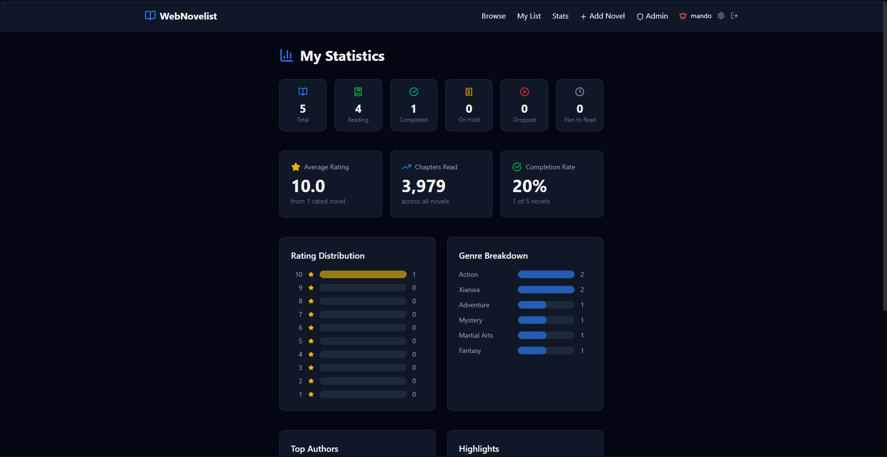

# 📚 WebNovelist

> An AniList-style tracker for web novels — log what you're reading, rate and review, build a library, and share a public profile.

**Live demo:** [webnovelist.vercel.app](https://novel.anthonyta.dev)


---

## Screenshots

| Home | Profile | Stats |
|------|---------|-------|
|  |  |  |

## Features

- **Reading list** — track novels across five statuses (Reading, Completed, On Hold, Dropped, Plan to Read), with per-entry rating, current chapter, reread count, notes, and a reading link.
- **Stats dashboard** — aggregate metrics across your library: totals by status, chapters read, and average rating.
- **Activity heatmap** — a GitHub-style contribution graph of your reading activity over the past year.
- **Public profiles** — shareable `/user/<username>` pages featuring favorite novels, authors, and characters.
- **Browse & search** — find novels by title, author, or genre.
- **Admin panel** — role-based user management, role assignment, and full novel catalog CRUD.
- **Authentication** — email/password and social-login-ready sign-in via Clerk, with secure sessions.
- **Image uploads** — avatars and novel covers handled through Cloudinary, plus customizable profile banners.

## Tech Stack

| Area | Choice |
|------|--------|
| Framework | Next.js 16 (App Router, React 19, Server Components) |
| Language | TypeScript |
| Auth | Clerk |
| Database / ORM | PostgreSQL (Supabase) + Prisma |
| Styling | Tailwind CSS v4 |
| Validation | Zod |
| Media | Cloudinary |
| Hosting | Vercel |

## Architecture Highlights

- **Clerk identity synced to relational data.** Clerk owns authentication and sessions, while a local `User` table owns app-specific data (username, role, favorites, reading list). The two are linked by a `clerkId` and kept in sync via Clerk webhooks, with **just-in-time provisioning** so a database row is created on first sign-in even before the webhook fires.
- **Authorization enforced on the server.** A single `getCurrentUser()` helper resolves the database user per request, and every API route verifies roles server-side (e.g. `canManageNovels`, admin-only checks) — the UI never gates security on its own.
- **Edge protection & security headers.** Route protection and hardening headers (`X-Frame-Options`, `Strict-Transport-Security`, etc.) run in a single Next.js 16 Proxy (`proxy.ts`).
- **Abuse resistance.** Rate limiting on sensitive endpoints (`rate-limiter-flexible`) plus Zod-based input validation and sanitization.

## Roles

| Role | Permissions |
|------|-------------|
| **Admin** | Full access — manage novels and users, no rate limits |
| **Moderator** | Add/edit novels, delete moderators and users |
| **User** | Browse, manage their own list, view stats |

## Running Locally

**Prerequisites:** Node.js 20+, a PostgreSQL database (e.g. [Supabase](https://supabase.com) or [Neon](https://neon.tech)), and free accounts on [Clerk](https://clerk.com) and [Cloudinary](https://cloudinary.com).

```bash
git clone https://github.com/anthonylhta/webnovelist.git
cd webnovelist
npm install        # runs `prisma generate` on postinstall
```

Copy the example env file and fill in your values:

```bash
cp .env.example .env
```

```bash
# Database (Postgres connection strings — pooled + direct)
DATABASE_URL=
DIRECT_URL=

# Clerk (Dashboard -> API keys)
NEXT_PUBLIC_CLERK_PUBLISHABLE_KEY=pk_test_xxx
CLERK_SECRET_KEY=sk_test_xxx
CLERK_WEBHOOK_SIGNING_SECRET=whsec_xxx   # optional locally (see note below)
NEXT_PUBLIC_CLERK_SIGN_IN_URL=/sign-in
NEXT_PUBLIC_CLERK_SIGN_UP_URL=/sign-up
NEXT_PUBLIC_CLERK_SIGN_IN_FALLBACK_REDIRECT_URL=/browse
NEXT_PUBLIC_CLERK_SIGN_UP_FALLBACK_REDIRECT_URL=/browse

# Cloudinary (image uploads)
CLOUDINARY_CLOUD_NAME=
CLOUDINARY_API_KEY=
CLOUDINARY_API_SECRET=
```

Apply the database schema (and optionally seed sample data):

```bash
npx prisma migrate dev      # creates tables from prisma/migrations
npx prisma db seed          # optional: seed starter data
```

Start the dev server:

```bash
npm run dev
```

Open [http://localhost:3000](http://localhost:3000).

> **Clerk webhooks are optional for local dev.** User rows are created via just-in-time provisioning on first sign-in, so you don't need a public webhook URL to develop — set `CLERK_WEBHOOK_SIGNING_SECRET` only when wiring up the webhook endpoint.

---

Built by [Anthony](https://github.com/anthonylhta).
